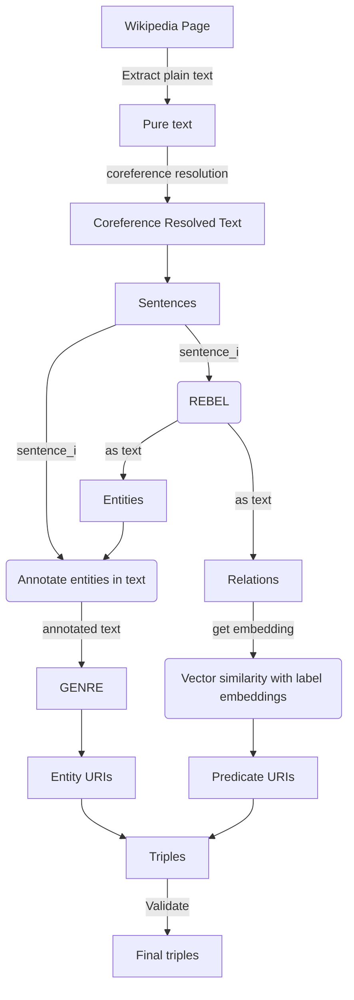

# Towards a Neural Extraction Framework in DBpedia

## Project Summary
The goal of this [project] is to develop a framework for predicate resolution of wiki links among entities.

This project will potentially generate millions of new statements. This new information could be released by DBpedia to the public as part of a new dataset. The creation of a neural extraction framework could introduce the use of robust parsers for a more accurate extraction of Wikipedia content.

### Mentors
Tommaso Soru, Ziwei XU, Mehrzad Shahinmoghadam, Yogesh Kulkarni

### Topics
Knowledge graphs, semantic web, ontology vocabularies, Extraction Framework

----

[DBpedia]: https://www.dbpedia.org/
[project]: https://summerofcode.withgoogle.com/programs/2024/projects/J4tJODFV
[Neural Extraction Framework]: https://github.com/dbpedia/neural-extraction-framework

### Project workflow

