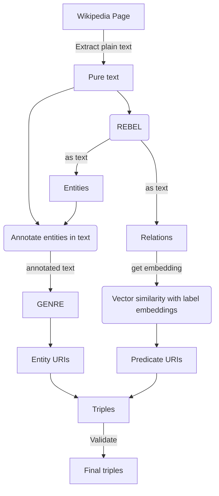

# Towards a Neural Extraction Framework in DBpedia

## Project Summary
The goal of this [project] is to develop a framework for predicate resolution of wiki links among entities.

This project will potentially generate millions of new statements. This new information could be released by DBpedia to the public as part of a new dataset. The creation of a neural extraction framework could introduce the use of robust parsers for a more accurate extraction of Wikipedia content.

### Current Status of the pipeline
- Presently, an end-to-end system that translates any English sentence into triples using the DBpedia vocabulary has been implemented in this pipeline. Currently the project is able to;
    - Extract text from a wikipedia article.
    - Generate triples (entities and relations) from sentences and articles.
    - Map the relations to its corresponding DBpedia predicate.
    - Link entities and predicates to its corresponding resources in the dbpedia ontology.

- However the project also has some drawbacks that needs improvement, which will be made as a contribution this year;
    - Most of the algorithm and machine learning models are not efficient enough to scale on millions of entities as it takes a long to generate a sigle triple.
    - The pipeline cannot suggest the creation of a new predicate if a similar predicate is not found for a relation.
    - Ability to adapt the pipeline output not only to the DBpedia vocabulary but to any specified one (e.g., SKOS, Wikidata, RDFS, or even a combination of many).
    - Validation of generated triples against the DBpedia ontology to avoid inconsistencies in data.
    - Categorising of extracted relations with respect to their semantics.
    - Ability to export our final triples into an RDF triples file

### Project workflow

### Mentors
Tommaso Soru, Ziwei XU, Mehrzad Shahinmoghadam, Yogesh Kulkarni

### Topics
Knowledge graphs, semantic web, ontology vocabularies, Extraction Framework

----

[DBpedia]: https://www.dbpedia.org/
[project]: https://summerofcode.withgoogle.com/programs/2024/projects/J4tJODFV
[Neural Extraction Framework]: https://github.com/dbpedia/neural-extraction-framework
